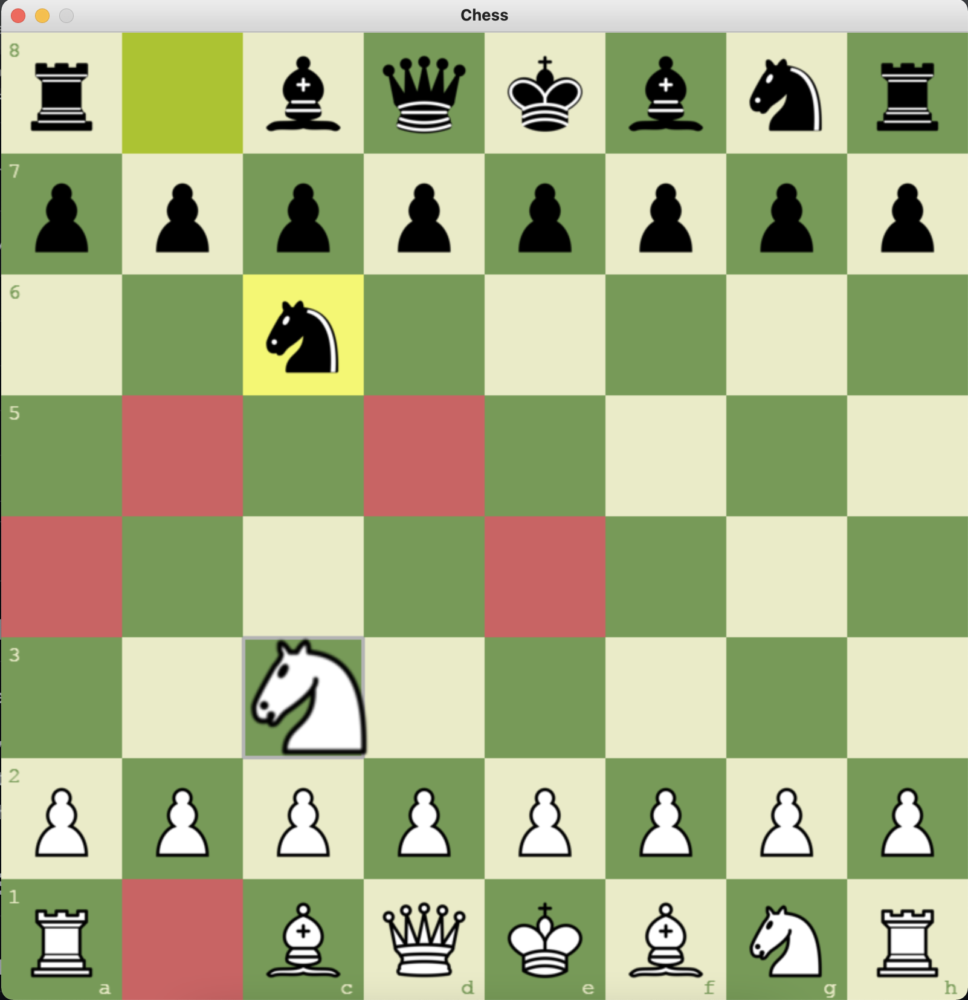

# Game Instructions

* Working on AI gamemode...

- Entry point: main.py
- Press 't' to change theme (green, brown, blue, gray)
- Press 'r' to restart the game

# Game Snapshots

## Snapshot 1 - Start (green)


## Snapshot 2 - Start (brown)


## Snapshot 3 - Start (blue)


## Snapshot 4 - Start (gray)


## Snapshot 5 - Valid Moves


## Snapshot 6 - Castling


## 🧠 How to Play

1. Clone the repo:
   ```bash
   git clone https://github.com/deepthiv1221/chess-game.git
   cd chess-game
Install dependencies:

bash
Copy
Edit
pip install pygame
Run the game:

bash
Copy
Edit
python src/main.py
📁 Project Structure
bash
Copy
Edit
├── src/
│   ├── main.py          # Entry point
│   ├── board.py         # Handles board layout and piece logic
│   ├── game.py          # Manages game state and rules
│   ├── dragger.py       # Handles piece dragging
│   ├── piece.py, move.py, square.py, etc.
├── assets/              # Piece images and theme files
├── snapshots/           # Game screenshots
├── README.md
🙋‍♀️ Author
Deepthi Vijay Kumar
Built as part of a personal project to explore game development and Python graphics.

✅ Future Enhancements
Add timer/clock for each player
Improve AI with Minimax algorithm
Multiplayer over LAN or Internet
